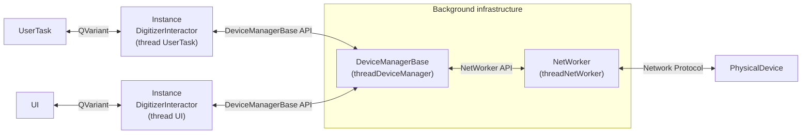

# DigitizerInteractor API Documentation

The DigitizerInteractor class is a high-level abstraction layer designed to manage firmware (FW) settings 
for connected devices in a **hierarchical** (device -> FW type -> parameter -> value) and **thread-safe** 
manner. It serves as an intermediary between the application's UI and the lower-level device management 
system (DeviceManagerBase, NetWorker).

## Dependencies and Project Setup

To use DigitizerInteractor in your project, you need to:

1. **Link libraries via CMake:**
   ```cmake
   target_link_libraries(${PROJECT_NAME}
       PRIVATE
       digiscope-api::digitizer-wrapper
       digiscope-api::event-packet
   )
   ```

2. **Add include paths for event-packet (Windows only):**
   ```cmake
   if(WIN32)
       target_include_directories(${PROJECT_NAME} PRIVATE 
           "${CMAKE_SOURCE_DIR}/digitizer-api/win64/${CMAKE_BUILD_TYPE}/include/event-packet"
       )
   endif()
   ```

3. **Include necessary header files:**
   ```cpp
   #include "digitizerinteractor.h"
   #include "packetwrappers/eventdata.h"  // For working with event data
   ```

## Architecture Overview



## Core Workflow

This flowchart illustrates the end-to-end process of configuring firmware settings on a target device 
using the DigitizerInteractor API. The sequence covers device discovery, parameter selection, value modification, 
and synchronization with the physical device.

```mermaid
graph TB
    creat["<b>1</b>. Initialize the DigitizerInteractor instance to interact with device firmware settings"]-->discovery["<b>2</b>. Set up device discovery callback for automatic device detection"]
    discovery-->select["<b>3</b>. Choose a specific device by its unique identifier ID"]
    select-->connect["<b>4</b>. Establish a communication channel with the selected device ID (connect to device)"]
    connect-->getFWTypes["<b>5</b>. Retrieve the list of supported firmware types (FWtype) for the device ID"]
    getFWTypes-->selectFWTypes["<b>6</b>. Choose a specific firmware type (FWtype) to configure for the device ID"] 
    selectFWTypes-->getSettings["<b>7</b>. Fetch all configurable setting names associated with the selected FWtype and device ID"]
    getSettings-->selectSettings["<b>8</b>. Pick a specific setting (SettingName) to modify for selected FWtype and device ID"]
    selectSettings-->getChannel["<b>9</b>. Get the number of available channels for selected FWtype and device ID"]
    getChannel-->setChannel["<b>10</b>. Choose a target channel for configuration for selected FWtype and device ID"]
    setChannel-->getValue["<b>11</b>. Read the current value of the selected SettingName for the chosen FWtype, channel and device ID"]  
    getValue-->setValue["<b>12</b>. Modify (as needed) the setting value of the selected SettingName for chosen FWtype, channel and device ID"]
    setValue-->push["<b>13</b>. Apply all pending changes to the physical device ID"]
    push-->fetch["<b>14</b>. Verify the updated settings by reading the device's ID current configuration"]
```



## 1. Device Discovery

The DigitizerInteractor class facilitates automatic device discovery through a background infrastructure involving 
DeviceManagerBase and NetWorker.

### 1.1 Device Detection Workflow

The device detection process runs in separate threads, without blocking the main application thread.

**Initialization of DigitizerInteractor:** When instantiated, it launches DeviceManagerBase thread and
DeviceManagerBase initializes NetWorker in a separate thread, which handles low-level network communication.

**NetWorker's Role:** 
- Listens for UDP broadcast messages from devices on the network.
- Parses incoming messages to extract device parameters (IP, device type, firmware version, etc.).

**Device Registration:** NetWorker forwards the decoded data to DeviceManagerBase. 
DeviceManagerBase dynamically creates a Device object and adds it to the managed devices list.
When a new device is discovered, the `deviceDiscovered` signal is emitted, which triggers the registered callback.

### 1.2 Automatic Device Discovery with Callbacks

Instead of manually polling for devices, applications should use the **setDeviceDiscoveryCallback** method to 
receive notifications when devices are discovered automatically.

**void setDeviceDiscoveryCallback(std::function<void(int64_t deviceId)> callback)**
- Sets a callback function that is called whenever a new device is discovered.
- The callback is invoked from the device manager thread.
- The callback receives the device ID of the newly discovered device.
- Setting `nullptr` disables the callback.

Usage Example:
```cpp
digi::DigitizerInteractor interactor;

interactor.setDeviceDiscoveryCallback([&interactor](int64_t deviceId) {
    QTimer::singleShot(0, [&interactor, deviceId]() {
        qDebug() << "Device discovered: " << deviceId;
        
        auto devices = interactor.devices();
        qDebug() << "Total devices: " << devices.size();
        
        for (auto it = devices.begin(); it != devices.end(); ++it) {
            qDebug() << "Device ID: " << it.key();
            qDebug() << "Device info: " << it.value();
        }
    });
});
```

### 1.3 Device Information Access

**QMap<int64_t, QList<QString>> devices()**
- Returns a complete snapshot of currently registered devices.
- The returned map contains:
  - **Keys**: Unique 64-bit integer identifier
  - **Values**: Corresponding device parameters as string lists
- Value string list order corresponds to **deviceHeaderLabels()** columns.

**QList<QString> deviceHeaderLabels()**
- Provides column headers for device information table.
- Returns list of human-readable column titles in display order.
- Column order: "Name", "Id", "State", "Serial number", "Description"

Usage Example:
```cpp
digi::DigitizerInteractor interactor;

auto headerLabels = interactor.deviceHeaderLabels();
qDebug() << "Device table columns: " << headerLabels;

auto detectedDevices = interactor.devices();
for (auto it = detectedDevices.begin(); it != detectedDevices.end(); ++it) {
    int64_t deviceId = it.key();
    const auto &deviceInfo = it.value();
    
    qDebug() << "Device ID: " << deviceId;
    for (int i = 0; i < deviceInfo.size() && i < headerLabels.size(); ++i) {
        qDebug() << "  " << headerLabels[i] << ": " << deviceInfo[i];
    }
}
```

## 2. Device Connection Management

The device connection management is performed using the following methods:

**bool connectDevice(int64_t id)**
- Establishes a connection with a device specified by its unique id.
- If the connection is successful, fetches the current configuration device and stores it locally for access/modification.
- Returns `true` on success, `false` on failure.

**bool disconnectDevice(int64_t id)**
- Terminates the connection with the device.
- Useful for resource cleanup or when switching devices.
- Returns `true` on success, `false` on failure.

**bool isDeviceConnected(int64_t id) const**
- Checks connection status of a specific device.
- Returns `true` if connected, `false` if disconnected.

Usage Example:
```cpp
digi::DigitizerInteractor interactor;

interactor.setDeviceDiscoveryCallback([&interactor](int64_t deviceId) {
    QTimer::singleShot(0, [&interactor, deviceId]() {
        auto devices = interactor.devices();
        
        if (!devices.empty()) {
            int64_t firstDeviceId = devices.begin().key();
            bool success = interactor.connectDevice(firstDeviceId);
            
            if (success) {
                qDebug() << "Device connected successfully!";
                qDebug() << "Channels: " << interactor.getDeviceChannels(firstDeviceId);
            }
        }
    });
});
```

## 3. Event Data Callbacks

The DigitizerInteractor provides callback mechanisms for receiving measurement data from devices in real-time.

Event data (`network::EventData`) contains two types of packets:
- **infoPacket** — informational event packets (PSD, PHA, Spectrum)
- **waveformPacket** — waveform data packets

### Available Event Packet Types (EventPacketType)

**Info packets:**
- `EventPacketType::PsdEventInfo` (1) — PSD event information
- `EventPacketType::PhaEventInfo` (3) — PHA event information
- `EventPacketType::ConsistentChannelSpectrum16` (8) — 16-bit channel spectrum
- `EventPacketType::ConsistentChannelSpectrum32` (9) — 32-bit channel spectrum

**Waveform packets:**
- `EventPacketType::InterleavedWaveform` (0) — interleaved waveform
- `EventPacketType::PsdWaveform` (2) — PSD waveform
- `EventPacketType::PhaWaveform` (4) — PHA waveform
- `EventPacketType::SplitUpWaveform` (7) — split up waveform

### 3.1 Single Event Data Callback

**void setDataEventCallback(std::function<void(const network::EventData &)> callback)**
- Sets a callback function for receiving single event data packets.
- The callback is called from the device manager thread.
- Event data contains both info and waveform packets.
- Setting `nullptr` disables the callback.

Usage Example with handling of various packet types:
```cpp
digi::DigitizerInteractor interactor;

interactor.setDataEventCallback([this](const network::EventData &eventData) {
    QTimer::singleShot(0, this, [this, eventData]() {
        // Process info packets
        if (eventData.infoPacket) {
            auto packetType = eventData.infoPacket->type();
            
            switch (packetType) {
                case network::EventPacketType::PsdEventInfo: {
                    auto psdPacket = qobject_cast<network::PsdEventPacket *>(
                        eventData.infoPacket.get());
                    if (psdPacket) {
                        qDebug() << "PSD Event - QShort: " << psdPacket->m_qShort;
                        qDebug() << "PSD Event - QLong: " << psdPacket->m_qLong;
                        qDebug() << "PSD Event - PSD Value: " << psdPacket->m_psdValue;
                        qDebug() << "PSD Event - Baseline: " << psdPacket->m_baseline;
                        qDebug() << "PSD Event - Height: " << psdPacket->m_height;
                        qDebug() << "PSD Event - Event Counter: " << psdPacket->m_eventCounter;
                    }
                    break;
                }
                
                case network::EventPacketType::PhaEventInfo: {
                    auto phaPacket = qobject_cast<network::PhaEventPacket *>(
                        eventData.infoPacket.get());
                    if (phaPacket) {
                        qDebug() << "PHA Event - Trap Baseline: " << phaPacket->m_trapBaseline;
                        qDebug() << "PHA Event - Trap Height Mean: " << phaPacket->m_trapHeightMean;
                        qDebug() << "PHA Event - Trap Height Max: " << phaPacket->m_trapHeightMax;
                        qDebug() << "PHA Event - Event Counter: " << phaPacket->m_eventCounter;
                        qDebug() << "PHA Event - RC Cr2 Y1: " << phaPacket->m_rcCr2Y1;
                        qDebug() << "PHA Event - RC Cr2 Y2: " << phaPacket->m_rcCr2Y2;
                    }
                    break;
                }
                
                case network::EventPacketType::ConsistentChannelSpectrum16:
                case network::EventPacketType::ConsistentChannelSpectrum32: {
                    auto spectrumPacket = qobject_cast<network::SpectrumEventPacket *>(
                        eventData.infoPacket.get());
                    if (spectrumPacket) {
                        qDebug() << "Spectrum Event - Type: " 
                                 << (packetType == network::EventPacketType::ConsistentChannelSpectrum16 
                                     ? "16-bit" : "32-bit");
                        qDebug() << "Spectrum Event - Array size: " << spectrumPacket->m_spectrum.size();
                        qDebug() << "Spectrum Event - Spectrum Type: " 
                                 << static_cast<int>(spectrumPacket->m_spectrumType);
                        if (!spectrumPacket->m_spectrum.empty()) {
                            qDebug() << "Spectrum Event - First value: " << spectrumPacket->m_spectrum[0];
                            qDebug() << "Spectrum Event - Last value: " 
                                     << spectrumPacket->m_spectrum.back();
                        }
                    }
                    break;
                }
                
                default:
                    qDebug() << "Unknown info packet type: " << static_cast<int>(packetType);
                    break;
            }
        }
        
        // Process waveform packets
        if (eventData.waveformPacket) {
            auto waveformPacket = qobject_cast<network::WaveformEventPacket *>(
                eventData.waveformPacket.get());
            if (waveformPacket) {
                auto packetType = waveformPacket->type();
                
                switch (packetType) {
                    case network::EventPacketType::PhaWaveform:
                        qDebug() << "PHA Waveform - Data points: " << waveformPacket->m_waveform.size();
                        qDebug() << "PHA Waveform - Decimation Factor: " << waveformPacket->m_decimationFactor;
                        if (!waveformPacket->m_waveform.empty()) {
                            qDebug() << "PHA Waveform - First value: " << waveformPacket->m_waveform[0];
                            qDebug() << "PHA Waveform - Last value: " << waveformPacket->m_waveform.back();
                        }
                        break;
                        
                    case network::EventPacketType::PsdWaveform:
                        qDebug() << "PSD Waveform - Data points: " << waveformPacket->m_waveform.size();
                        qDebug() << "PSD Waveform - Decimation Factor: " << waveformPacket->m_decimationFactor;
                        if (!waveformPacket->m_waveform.empty()) {
                            qDebug() << "PSD Waveform - First value: " << waveformPacket->m_waveform[0];
                            qDebug() << "PSD Waveform - Last value: " << waveformPacket->m_waveform.back();
                        }
                        break;
                        
                    case network::EventPacketType::InterleavedWaveform:
                        qDebug() << "Interleaved Waveform - Data points: " << waveformPacket->m_waveform.size();
                        qDebug() << "Interleaved Waveform - Decimation Factor: " << waveformPacket->m_decimationFactor;
                        break;
                        
                    case network::EventPacketType::SplitUpWaveform:
                        qDebug() << "Split Up Waveform - Data points: " << waveformPacket->m_waveform.size();
                        qDebug() << "Split Up Waveform - Decimation Factor: " << waveformPacket->m_decimationFactor;
                        break;
                        
                    default:
                        qDebug() << "Unknown waveform packet type: " << static_cast<int>(packetType);
                        break;
                }
            }
        }
    });
});
```

### 3.2 Batch Event Data Callback

**void setDataBatchCallback(std::function<void(const QVector<network::EventData> &batch)> callback)**
- Sets a callback function for receiving batch event data.
- The callback is called from the device manager thread.
- Batch contains multiple event data packets processed together.
- Setting `nullptr` disables the callback.

Usage Example:
```cpp
digi::DigitizerInteractor interactor;

interactor.setDataBatchCallback([this](const QVector<network::EventData> &batch) {
    QTimer::singleShot(0, this, [this, batch]() {
        qDebug() << "Received batch of " << batch.size() << " events";
        
        for (const auto &eventData : batch) {
            if (eventData.infoPacket) {
                qDebug() << "Processing event packet type: " 
                         << static_cast<int>(eventData.infoPacket->type());
            }
        }
    });
});
```

## 4. Settings Transfer

The settings are transmitted using two structures in JSON format. The first structure contains 
the firmware metadata, and the second structure contains firmware parameter values.

### 4.1 Download Settings

**bool downloadSettings(int64_t id)**
- Fetches the current configuration from a specified device with id (Unique 64-bit device identifier).
- Stores settings locally for access/modification.
- Returns `true` on successful retrieval, `false` on failure (timeout/communication error).
- **Note:** Device must be connected before downloading settings.

Usage Example:
```cpp
digi::DigitizerInteractor interactor;
int64_t deviceId = 123456789;

if (interactor.connectDevice(deviceId)) {
    if (interactor.downloadSettings(deviceId)) {
        auto settings = interactor.fwSettingList(deviceId, digi::FWType::PHA);
        qDebug() << "Settings downloaded. Available settings: " << settings;
    } else {
        qWarning() << "Settings download failed!";
    }
}
```

### 4.2 Upload Settings

**bool uploadSettings(int64_t id)**
- Pushes modified settings from the application back to the physical device.
- The operation is performed in the following order:
  1. Validates the target device connection status;
  2. Packages modified settings from local cache into JSON device-specific protocol format;
  3. Batch transmission of settings;
  4. Acknowledgement waiting with timeout;
  5. Returns `true` only after all settings are transmitted and device confirms successful application.
- **Note:** Device must be connected before uploading settings.

Usage Example:
```cpp
digi::DigitizerInteractor interactor;
int64_t deviceId = 123456789;

if (interactor.connectDevice(deviceId)) {
    if (interactor.downloadSettings(deviceId)) {
        interactor.setSetting(deviceId, digi::FWType::PHA, "Threshold", 1, 250);
        
        if (!interactor.uploadSettings(deviceId)) {
            qWarning() << "Settings upload failed!";
        } else {
            qDebug() << "Settings uploaded successfully!";
        }
    }
}
```

### 4.3 Retrieve Firmware Settings

**std::pair<QString, QString> firmwareSettings(const int64_t &id)**
- Retrieves firmware configuration in JSON device-specific protocol format for specified device from local cache.
- Returns `std::pair<QString, QString>` where:
  - **first**: JSON string containing firmware metadata (version, parameters, etc.);
  - **second**: JSON string with current parameter values.
- If device id not found, both values are empty.
- **Note:** Settings must be downloaded first using `downloadSettings()`.

Usage Example:
```cpp
digi::DigitizerInteractor interactor;
int64_t deviceId = 123456789;

if (interactor.downloadSettings(deviceId)) {
    const auto& [jsonMetadata, jsonValues] = interactor.firmwareSettings(deviceId);
    
    qDebug() << "Raw metadata:\n" << jsonMetadata;
    qDebug() << "Raw values:\n" << jsonValues;
    
    QJsonParseError error;
    auto metadataDoc = QJsonDocument::fromJson(jsonMetadata.toUtf8(), &error);
    if (error.error == QJsonParseError::NoError) {
        qDebug() << "Parsed metadata:\n" << metadataDoc.toJson(QJsonDocument::Indented);
    }
}
```

## 4.4 Configuration Files (`.dconf`)

Digitizer API supports export/import/apply operations for `.dconf` configuration files.

### API Methods

- `bool writeConfigurationFile(int64_t id, const QString &path) const`
  - Exports current cached firmware schema/settings of a device to `.dconf`.
  - Returns `false` if device/settings are unavailable or file write fails.

- `ConfigurationFileResult readConfigurationFile(const QString &path) const`
  - Validates `.dconf` file accessibility and binary format without applying it.
  - Returns only operation status + message.
  - Security rule: schema/settings payload is not exposed to API user.

- `ConfigurationFileResult applyConfigurationFile(int64_t id, const QString &path)`
  - Applies `.dconf` to selected device with cross-schema validation.
  - Validation is done against:
    - active schema of target device,
    - schema stored inside `.dconf`,
    - initialized model sections in wrapper.

### Statuses (`ConfigurationFileStatus`)

- `FileOpenError`
- `FileFormatInvalid`
- `SchemaNotInitialized`
- `SettingsSchemaMismatch`
- `DeviceNotReady`
- `Applied`

### Example: Export current configuration to `.dconf`

```cpp
digi::DigitizerInteractor interactor;
const int64_t deviceId = 123456789;
const QString filePath = "C:/configs/device_123456789.dconf";

if (interactor.connectDevice(deviceId) && interactor.downloadSettings(deviceId)) {
    if (!interactor.writeConfigurationFile(deviceId, filePath)) {
        qWarning() << "Failed to export .dconf file";
    } else {
        qDebug() << "Configuration exported to:" << filePath;
    }
}
```

### Example: Validate `.dconf` file (without apply)

```cpp
digi::DigitizerInteractor interactor;
const QString filePath = "C:/configs/device_123456789.dconf";

const auto result = interactor.readConfigurationFile(filePath);
if (result.status != digi::ConfigurationFileStatus::Applied) {
    qWarning() << "Validation failed:" << result.message;
} else {
    qDebug() << ".dconf file is valid and readable";
}
```

### Example: Apply `.dconf` to device

```cpp
digi::DigitizerInteractor interactor;
const int64_t deviceId = 123456789;
const QString filePath = "C:/configs/foreign_device_config.dconf";

if (interactor.connectDevice(deviceId) && interactor.downloadSettings(deviceId)) {
    const auto applyResult = interactor.applyConfigurationFile(deviceId, filePath);
    switch (applyResult.status) {
    case digi::ConfigurationFileStatus::Applied:
        qDebug() << "Configuration applied successfully";
        break;
    case digi::ConfigurationFileStatus::SettingsSchemaMismatch:
        qWarning() << "Configuration is incompatible with current device schema/models";
        break;
    default:
        qWarning() << "Apply failed:" << applyResult.message;
        break;
    }
}
```

## 5. Settings Management

Settings Management API includes parameter discovery and parameter access methods.

### 5.1 Discovery Methods

**std::vector<FWType> fwTypeList(const int64_t &id) const**
- Returns a list of firmware types (FWType) available for the device with the specified ID.
- Returns empty vector if device is not found or not connected.
- Possible values: `FWType::Device`, `FWType::PHA`, `FWType::PSD`, `FWType::WAVEFORM`.

Usage Example:
```cpp
digi::DigitizerInteractor interactor;
int64_t deviceId = 123456789;

if (interactor.isDeviceConnected(deviceId)) {
    auto fwTypes = interactor.fwTypeList(deviceId);
    
    for (const auto& fwType : fwTypes) {
        qDebug() << "Firmware type: " << interactor.fwType2Name(fwType);
    }
}
```

**QStringList fwTypeNameList(const int64_t &id) const**
- Returns human-readable names of supported firmware types available for the device with the specified ID.
- Returns empty list if device is not found or not connected.
- Possible values: `{"Device", "PHA", "PSD", "WAVEFORM"}`.

Usage Example:
```cpp
digi::DigitizerInteractor interactor;
int64_t deviceId = 123456789;

if (interactor.isDeviceConnected(deviceId)) {
    auto typeNames = interactor.fwTypeNameList(deviceId);
    qDebug() << "Available firmware types: " << typeNames.join(", ");
}
```

**QStringList fwSettingList(const int64_t &id, const FWType &fwType) const**
**QStringList fwSettingList(const int64_t &id, const QString &fwTypeName) const**
- Retrieves settings parameter names for specific firmware type.
- Returns empty list if device is not found, not connected, or settings not downloaded.
- **Note:** Settings must be downloaded first using `downloadSettings()`.

Usage Example:
```cpp
digi::DigitizerInteractor interactor;
int64_t deviceId = 123456789;

if (interactor.isDeviceConnected(deviceId)) {
    if (interactor.downloadSettings(deviceId)) {
        auto deviceSettings = interactor.fwSettingList(deviceId, digi::FWType::Device);
        auto phaSettings = interactor.fwSettingList(deviceId, "PHA");
        
        qDebug() << "Device settings count: " << deviceSettings.size();
        for (int i = 0; i < deviceSettings.size(); ++i) {
            qDebug() << (i + 1) << ". " << deviceSettings[i];
        }
        
        qDebug() << "PHA settings count: " << phaSettings.size();
        for (int i = 0; i < phaSettings.size(); ++i) {
            qDebug() << (i + 1) << ". " << phaSettings[i];
        }
    }
}
```

### 5.2 Parameter Access Methods

---

## ⚠️ IMPORTANT: Local Settings Changes

**The `getSetting()` and `setSetting()` methods work only with the local API data model and do NOT apply changes to the physical device directly.**

- **`getSetting()`** — reads values from the local settings cache
- **`setSetting()`** — modifies values only in the local data model
- **To actually apply changes to the device, you must call `uploadSettings()`**

Changes made via `setSetting()` remain in application memory until `uploadSettings()` is called, which sends all accumulated changes to the physical device.

---

**QVariant getSetting(const int64_t &id, const FWType &fwType, const QString &name, const int &column) const**
**QVariant getSetting(const int64_t &id, const QString &fwTypeName, const QString &name, const int &column) const**
- Retrieves firmware setting values with type-specific column interpretations.
- **Parameters:**
  - `id (int64_t)`: The unique identifier of the target device.
  - `fwType (FWType)`: The firmware type/enumeration (Device, PHA, PSD, WAVEFORM).
  - `fwTypeName (QString)`: The human-readable name firmware type ("Device", "PHA", "PSD", "WAVEFORM").
  - `name (QString)`: The name of the setting to retrieve (case-sensitive).
  - `column (int)`: The channel number/data index to retrieve. fwType determines column semantics:
    - **FWType::Device: column 1**: Current device setting value
    - **FWType::PHA/PSD/WAVEFORM:**
      - `column 0`: Default value (applies to all channels)
      - `column 1-N`: Channel-specific values (where N = device channel count)
    - **Note:** In the API context, the `column` parameter is interpreted as a channel number. For firmware types other than Device, column 0 corresponds to the default value, and columns 1-N correspond to specific device channels.
- Returns `QVariant` containing the requested value, or invalid `QVariant()` if setting/column not found.

Usage Example:
```cpp
digi::DigitizerInteractor interactor;
int64_t deviceId = 123456789;

if (interactor.isDeviceConnected(deviceId) && interactor.downloadSettings(deviceId)) {
    QString fwTypeName = "Device";
    QString param1 = "fpgaFirmwares";
    QString param2 = "fanControl";
    int column = 1;
    
    auto value1 = interactor.getSetting(deviceId, fwTypeName, param1, column);
    auto value2 = interactor.getSetting(deviceId, fwTypeName, param2, column);
    
    qDebug() << "Current device values:";
    qDebug() << "- " << param1 << " = " << value1;
    qDebug() << "- " << param2 << " = " << value2;
}
```

**bool setSetting(const int64_t &id, const FWType &fwType, const QString &name, const int &column, const QVariant &value) const**
**bool setSetting(const int64_t &id, const QString &fwTypeName, const QString &name, const int &column, const QVariant &value) const**
- Modifies a specific setting in a device's firmware configuration.
- **Parameters:**
  - `id (int64_t)`: The unique identifier of the target device.
  - `fwType (FWType)`: The firmware type/enumeration (Device, PHA, PSD, WAVEFORM).
  - `fwTypeName (QString)`: The human-readable name firmware type ("Device", "PHA", "PSD", "WAVEFORM").
  - `name (QString)`: The name of the setting to modify (case-sensitive).
  - `column (int)`: The channel number/data index to modify. fwType determines column semantics:
    - **FWType::Device: column 1**: Current device setting value
    - **FWType::PHA/PSD/WAVEFORM:**
      - `column 0`: Default value (updates all channels)
      - `column 1-N`: Channel-specific values (where N = device channel count)
    - **Note:** In the API context, the `column` parameter is interpreted as a channel number. For firmware types other than Device, column 0 corresponds to the default value, and columns 1-N correspond to specific device channels.
  - `value (QVariant)`: The new value to set (type must match setting requirements).
- Returns `true` if value was successfully updated, `false` if update failed.
- **Note:** Changes are stored locally and must be uploaded using `uploadSettings()`.

Usage Example:
```cpp
digi::DigitizerInteractor interactor;
int64_t deviceId = 123456789;

if (interactor.isDeviceConnected(deviceId) && interactor.downloadSettings(deviceId)) {
    QString fwTypeName = "Device";
    QString param1 = "fpgaFirmwares";
    QString param2 = "fanControl";
    int column = 1;
    
    auto oldValue1 = interactor.getSetting(deviceId, fwTypeName, param1, column);
    auto oldValue2 = interactor.getSetting(deviceId, fwTypeName, param2, column);
    
    qDebug() << "Current values:";
    qDebug() << "- " << param1 << " = " << oldValue1;
    qDebug() << "- " << param2 << " = " << oldValue2;
    
    bool success1 = interactor.setSetting(deviceId, fwTypeName, param1, column, 2);
    bool success2 = interactor.setSetting(deviceId, fwTypeName, param2, column, true);
    
    if (!success1) {
        qWarning() << "Failed to set " << param1;
    }
    if (!success2) {
        qWarning() << "Failed to set " << param2;
    }
    
    if (success1 || success2) {
        if (interactor.uploadSettings(deviceId)) {
            qDebug() << "Settings uploaded successfully!";
            
            auto newValue1 = interactor.getSetting(deviceId, fwTypeName, param1, column);
            auto newValue2 = interactor.getSetting(deviceId, fwTypeName, param2, column);
            
            qDebug() << "New values:";
            qDebug() << "- " << param1 << " = " << newValue1;
            qDebug() << "- " << param2 << " = " << newValue2;
        } else {
            qCritical() << "Settings upload failed!";
        }
    }
}
```

### 5.3 Utility Methods

**QString fwType2Name(FWType fwType) const**
- Converts firmware type enum to its human-readable name.
- Returns display name for the firmware type.

**std::optional<FWType> fwName2Type(QString fwTypeName) const**
- Converts firmware human-readable name to its enum value.
- Returns `std::optional<FWType>` containing the value if matched, empty if no match found.

**uint16_t getDeviceChannels(const int64_t id) const**
- Retrieves the number of available channels for a device.
- Returns `0` if device ID doesn't exist or device is not connected.

Usage Example:
```cpp
digi::DigitizerInteractor interactor;
int64_t deviceId = 123456789;

if (interactor.isDeviceConnected(deviceId)) {
    uint16_t channels = interactor.getDeviceChannels(deviceId);
    qDebug() << "Device has " << channels << " channels";
    
    auto fwType = digi::FWType::PHA;
    QString fwTypeName = interactor.fwType2Name(fwType);
    qDebug() << "Firmware type name: " << fwTypeName;
    
    auto parsedType = interactor.fwName2Type("PSD");
    if (parsedType.has_value()) {
        qDebug() << "Parsed firmware type: " << static_cast<int>(parsedType.value());
    }
}
```

## 6. Measurement Control

**bool startMeasure(int64_t id)**
- Attempts to start measurement on a device.
- If successful, device will start measuring and sending data.
- Returns `true` on success, `false` on failure.
- **Note:** Device must be connected before starting measurement.

**bool stopMeasure(int64_t id)**
- Stops measurement on the specified device.
- Returns `true` on success, `false` on failure.
- **Note:** Device must be connected and measuring.

**bool isDeviceMeasuring(int64_t id) const**
- Checks measurement status of a specific device.
- Returns `true` if device is measuring, `false` otherwise.
- **Note:** Device must be connected.

Usage Example:
```cpp
digi::DigitizerInteractor interactor;
int64_t deviceId = 123456789;

if (interactor.isDeviceConnected(deviceId)) {
    interactor.setDataEventCallback([this](const network::EventData &eventData) {
        QTimer::singleShot(0, this, [this, eventData]() {
            processEventData(eventData);
        });
    });
    
    if (interactor.startMeasure(deviceId)) {
        qDebug() << "Measurement started";
        
        QTimer::singleShot(5000, [&interactor, deviceId]() {
            if (interactor.isDeviceMeasuring(deviceId)) {
                qDebug() << "Device is still measuring";
                interactor.stopMeasure(deviceId);
                qDebug() << "Measurement stopped";
            }
        });
    }
}
```

## Complete Example

```cpp
#include "digitizerinteractor.h"
#include <QTimer>
#include <QDebug>

using namespace digi;

class MyApplication : public QObject
{
    Q_OBJECT
    
public:
    MyApplication() {
        m_interactor.setDeviceDiscoveryCallback([this](int64_t deviceId) {
            QTimer::singleShot(0, this, [this, deviceId]() {
                onDeviceDiscovered(deviceId);
            });
        });
        
        m_interactor.setDataEventCallback([this](const network::EventData &eventData) {
            QTimer::singleShot(0, this, [this, eventData]() {
                onEventDataReceived(eventData);
            });
        });
    }
    
private slots:
    void onDeviceDiscovered(int64_t deviceId) {
        qDebug() << "Device discovered: " << deviceId;
        
        if (m_interactor.connectDevice(deviceId)) {
            qDebug() << "Device connected";
            
            if (m_interactor.downloadSettings(deviceId)) {
                qDebug() << "Settings downloaded";
                
                auto fwTypes = m_interactor.fwTypeList(deviceId);
                qDebug() << "Firmware types: " << fwTypes.size();
                
                if (m_interactor.startMeasure(deviceId)) {
                    qDebug() << "Measurement started";
                }
            }
        }
    }
    
    void onEventDataReceived(const network::EventData &eventData) {
        if (eventData.infoPacket) {
            auto packetType = eventData.infoPacket->type();
            qDebug() << "Received event packet type: " << static_cast<int>(packetType);
        }
    }
    
private:
    DigitizerInteractor m_interactor;
};
```

