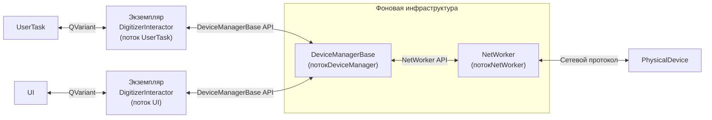

# Документация API DigitizerInteractor

Класс DigitizerInteractor — высокоуровневый слой абстракции для управления настройками прошивки (FW) 
подключенных устройств в **иерархическом** (устройство -> тип FW -> параметр -> значение) и **потокобезопасном** 
режиме. Служит промежуточным звеном между пользовательским интерфейсом приложения и низкоуровневой системой 
управления устройствами (DeviceManagerBase, NetWorker).

## Зависимости и настройка проекта

Для использования DigitizerInteractor в вашем проекте необходимо:

1. **Подключить библиотеки через CMake:**
   ```cmake
   target_link_libraries(${PROJECT_NAME}
       PRIVATE
       digiscope-api::digitizer-wrapper
       digiscope-api::event-packet
   )
   ```

2. **Добавить пути включения для event-packet (только для Windows):**
   ```cmake
   if(WIN32)
       target_include_directories(${PROJECT_NAME} PRIVATE 
           "${CMAKE_SOURCE_DIR}/digitizer-api/win64/${CMAKE_BUILD_TYPE}/include/event-packet"
       )
   endif()
   ```

3. **Включить необходимые заголовочные файлы:**
   ```cpp
   #include "digitizerinteractor.h"
   #include "packetwrappers/eventdata.h"  // Для работы с данными событий
   ```

## Обзор архитектуры



## Основной рабочий процесс

Эта блок-схема иллюстрирует полный процесс конфигурации настроек прошивки целевого устройства 
с использованием API DigitizerInteractor. Последовательность включает обнаружение устройств, выбор параметров, 
изменение значений и синхронизацию с физическим устройством.

```mermaid
graph TB
    creat["<b>1</b>. Инициализация экземпляра DigitizerInteractor для взаимодействия с настройками прошивки устройства"]-->discovery["<b>2</b>. Настройка callback для автоматического обнаружения устройств"]
    discovery-->select["<b>3</b>. Выбор конкретного устройства по его уникальному идентификатору ID"]
    select-->connect["<b>4</b>. Установка канала связи с выбранным устройством ID (подключение к устройству)"]
    connect-->getFWTypes["<b>5</b>. Получение списка поддерживаемых типов прошивки (FWtype) для устройства ID"]
    getFWTypes-->selectFWTypes["<b>6</b>. Выбор конкретного типа прошивки (FWtype) для конфигурации устройства ID"] 
    selectFWTypes-->getSettings["<b>7</b>. Получение всех имен настраиваемых параметров для выбранного FWtype и устройства ID"]
    getSettings-->selectSettings["<b>8</b>. Выбор конкретного параметра (SettingName) для изменения для выбранного FWtype и устройства ID"]
    selectSettings-->getChannel["<b>9</b>. Получение количества доступных каналов для выбранного FWtype и устройства ID"]
    getChannel-->setChannel["<b>10</b>. Выбор целевого канала для конфигурации для выбранного FWtype и устройства ID"]
    setChannel-->getValue["<b>11</b>. Чтение текущего значения выбранного SettingName для выбранного FWtype, канала и устройства ID"]  
    getValue-->setValue["<b>12</b>. Изменение (при необходимости) значения параметра выбранного SettingName для выбранного FWtype, канала и устройства ID"]
    setValue-->push["<b>13</b>. Применение всех ожидающих изменений к физическому устройству ID"]
    push-->fetch["<b>14</b>. Проверка обновленных настроек путем чтения текущей конфигурации устройства ID"]
```



## 1. Обнаружение устройств

Класс DigitizerInteractor обеспечивает автоматическое обнаружение устройств через фоновую инфраструктуру, 
включающую DeviceManagerBase и NetWorker.

### 1.1 Процесс обнаружения устройств

Процесс обнаружения устройств выполняется в отдельных потоках, не блокируя основной поток приложения.

**Инициализация DigitizerInteractor:** При создании экземпляра запускается поток DeviceManagerBase, а
DeviceManagerBase инициализирует NetWorker в отдельном потоке, который обрабатывает низкоуровневую сетевую связь.

**Роль NetWorker:** 
- Прослушивает UDP broadcast сообщения от устройств в сети.
- Парсит входящие сообщения для извлечения параметров устройства (IP, тип устройства, версия прошивки и т.д.).

**Регистрация устройств:** NetWorker передает декодированные данные в DeviceManagerBase. 
DeviceManagerBase динамически создает объект Device и добавляет его в список управляемых устройств.
При обнаружении нового устройства генерируется сигнал `deviceDiscovered`, который вызывает зарегистрированный callback.

### 1.2 Автоматическое обнаружение устройств с использованием callback

Вместо ручного опроса устройств, приложения должны использовать метод **setDeviceDiscoveryCallback** для 
получения уведомлений при автоматическом обнаружении устройств.

**void setDeviceDiscoveryCallback(std::function<void(int64_t deviceId)> callback)**
- Устанавливает функцию callback, которая вызывается при обнаружении нового устройства.
- Callback вызывается из потока менеджера устройств.
- Callback получает ID устройства вновь обнаруженного устройства.
- Установка `nullptr` отключает callback.

Пример использования:
```cpp
digi::DigitizerInteractor interactor;

interactor.setDeviceDiscoveryCallback([&interactor](int64_t deviceId) {
    QTimer::singleShot(0, [&interactor, deviceId]() {
        qDebug() << "Обнаружено устройство: " << deviceId;
        
        auto devices = interactor.devices();
        qDebug() << "Всего устройств: " << devices.size();
        
        for (auto it = devices.begin(); it != devices.end(); ++it) {
            qDebug() << "ID устройства: " << it.key();
            qDebug() << "Информация об устройстве: " << it.value();
        }
    });
});
```

### 1.3 Доступ к информации об устройствах

**QMap<int64_t, QList<QString>> devices()**
- Возвращает полный снимок текущих зарегистрированных устройств.
- Возвращаемая карта содержит:
  - **Ключи**: Уникальный 64-битный целочисленный идентификатор
  - **Значения**: Соответствующие параметры устройства в виде списков строк
- Порядок элементов списка строк соответствует столбцам **deviceHeaderLabels()**.

**QList<QString> deviceHeaderLabels()**
- Предоставляет заголовки столбцов для таблицы информации об устройствах.
- Возвращает список читаемых заголовков столбцов в порядке отображения.
- Порядок столбцов: "Name", "Id", "State", "Serial number", "Description"

Пример использования:
```cpp
digi::DigitizerInteractor interactor;

auto headerLabels = interactor.deviceHeaderLabels();
qDebug() << "Столбцы таблицы устройств: " << headerLabels;

auto detectedDevices = interactor.devices();
for (auto it = detectedDevices.begin(); it != detectedDevices.end(); ++it) {
    int64_t deviceId = it.key();
    const auto &deviceInfo = it.value();
    
    qDebug() << "ID устройства: " << deviceId;
    for (int i = 0; i < deviceInfo.size() && i < headerLabels.size(); ++i) {
        qDebug() << "  " << headerLabels[i] << ": " << deviceInfo[i];
    }
}
```

## 2. Управление подключением устройств

Управление подключением устройств выполняется с использованием следующих методов:

**bool connectDevice(int64_t id)**
- Устанавливает подключение к устройству, указанному по его уникальному id.
- При успешном подключении получает текущую конфигурацию устройства и сохраняет её локально для доступа/изменения.
- Возвращает `true` при успехе, `false` при неудаче.

**bool disconnectDevice(int64_t id)**
- Завершает подключение к устройству.
- Полезно для освобождения ресурсов или при переключении устройств.
- Возвращает `true` при успехе, `false` при неудаче.

**bool isDeviceConnected(int64_t id) const**
- Проверяет статус подключения конкретного устройства.
- Возвращает `true` если подключено, `false` если отключено.

Пример использования:
```cpp
digi::DigitizerInteractor interactor;

interactor.setDeviceDiscoveryCallback([&interactor](int64_t deviceId) {
    QTimer::singleShot(0, [&interactor, deviceId]() {
        auto devices = interactor.devices();
        
        if (!devices.empty()) {
            int64_t firstDeviceId = devices.begin().key();
            bool success = interactor.connectDevice(firstDeviceId);
            
            if (success) {
                qDebug() << "Устройство успешно подключено!";
                qDebug() << "Каналы: " << interactor.getDeviceChannels(firstDeviceId);
            }
        }
    });
});
```

## 3. Callback для данных событий

DigitizerInteractor предоставляет механизмы callback для получения данных измерений от устройств в реальном времени.

Данные событий (`network::EventData`) содержат два типа пакетов:
- **infoPacket** — информационные пакеты событий (PSD, PHA, Spectrum)
- **waveformPacket** — пакеты с данными формы сигнала (Waveform)

### Доступные типы пакетов событий (EventPacketType)

**Info пакеты:**
- `EventPacketType::PsdEventInfo` (1) — информация о PSD событии
- `EventPacketType::PhaEventInfo` (3) — информация о PHA событии
- `EventPacketType::ConsistentChannelSpectrum16` (8) — спектр канала 16-bit
- `EventPacketType::ConsistentChannelSpectrum32` (9) — спектр канала 32-bit

**Waveform пакеты:**
- `EventPacketType::InterleavedWaveform` (0) — перемешанная форма сигнала
- `EventPacketType::PsdWaveform` (2) — форма сигнала PSD
- `EventPacketType::PhaWaveform` (4) — форма сигнала PHA
- `EventPacketType::SplitUpWaveform` (7) — разделенная форма сигнала

### 3.1 Callback для одиночных событий

**void setDataEventCallback(std::function<void(const network::EventData &)> callback)**
- Устанавливает функцию callback для получения одиночных пакетов данных событий.
- Callback вызывается из потока менеджера устройств.
- Данные события содержат как info, так и waveform пакеты.
- Установка `nullptr` отключает callback.

Пример использования с обработкой различных типов пакетов:
```cpp
digi::DigitizerInteractor interactor;

interactor.setDataEventCallback([this](const network::EventData &eventData) {
    QTimer::singleShot(0, this, [this, eventData]() {
        // Обработка info пакетов
        if (eventData.infoPacket) {
            auto packetType = eventData.infoPacket->type();
            
            switch (packetType) {
                case network::EventPacketType::PsdEventInfo: {
                    auto psdPacket = qobject_cast<network::PsdEventPacket *>(
                        eventData.infoPacket.get());
                    if (psdPacket) {
                        qDebug() << "PSD событие - QShort: " << psdPacket->m_qShort;
                        qDebug() << "PSD событие - QLong: " << psdPacket->m_qLong;
                        qDebug() << "PSD событие - PSD значение: " << psdPacket->m_psdValue;
                        qDebug() << "PSD событие - Baseline: " << psdPacket->m_baseline;
                        qDebug() << "PSD событие - Height: " << psdPacket->m_height;
                        qDebug() << "PSD событие - Event Counter: " << psdPacket->m_eventCounter;
                    }
                    break;
                }
                
                case network::EventPacketType::PhaEventInfo: {
                    auto phaPacket = qobject_cast<network::PhaEventPacket *>(
                        eventData.infoPacket.get());
                    if (phaPacket) {
                        qDebug() << "PHA событие - Trap Baseline: " << phaPacket->m_trapBaseline;
                        qDebug() << "PHA событие - Trap Height Mean: " << phaPacket->m_trapHeightMean;
                        qDebug() << "PHA событие - Trap Height Max: " << phaPacket->m_trapHeightMax;
                        qDebug() << "PHA событие - Event Counter: " << phaPacket->m_eventCounter;
                        qDebug() << "PHA событие - RC Cr2 Y1: " << phaPacket->m_rcCr2Y1;
                        qDebug() << "PHA событие - RC Cr2 Y2: " << phaPacket->m_rcCr2Y2;
                    }
                    break;
                }
                
                case network::EventPacketType::ConsistentChannelSpectrum16:
                case network::EventPacketType::ConsistentChannelSpectrum32: {
                    auto spectrumPacket = qobject_cast<network::SpectrumEventPacket *>(
                        eventData.infoPacket.get());
                    if (spectrumPacket) {
                        qDebug() << "Spectrum событие - Тип: " 
                                 << (packetType == network::EventPacketType::ConsistentChannelSpectrum16 
                                     ? "16-bit" : "32-bit");
                        qDebug() << "Spectrum событие - Размер массива: " << spectrumPacket->m_spectrum.size();
                        qDebug() << "Spectrum событие - Spectrum Type: " 
                                 << static_cast<int>(spectrumPacket->m_spectrumType);
                        if (!spectrumPacket->m_spectrum.empty()) {
                            qDebug() << "Spectrum событие - Первое значение: " << spectrumPacket->m_spectrum[0];
                            qDebug() << "Spectrum событие - Последнее значение: " 
                                     << spectrumPacket->m_spectrum.back();
                        }
                    }
                    break;
                }
                
                default:
                    qDebug() << "Неизвестный тип info пакета: " << static_cast<int>(packetType);
                    break;
            }
        }
        
        // Обработка waveform пакетов
        if (eventData.waveformPacket) {
            auto waveformPacket = qobject_cast<network::WaveformEventPacket *>(
                eventData.waveformPacket.get());
            if (waveformPacket) {
                auto packetType = waveformPacket->type();
                
                switch (packetType) {
                    case network::EventPacketType::PhaWaveform:
                        qDebug() << "PHA Waveform - Точек данных: " << waveformPacket->m_waveform.size();
                        qDebug() << "PHA Waveform - Decimation Factor: " << waveformPacket->m_decimationFactor;
                        if (!waveformPacket->m_waveform.empty()) {
                            qDebug() << "PHA Waveform - Первое значение: " << waveformPacket->m_waveform[0];
                            qDebug() << "PHA Waveform - Последнее значение: " << waveformPacket->m_waveform.back();
                        }
                        break;
                        
                    case network::EventPacketType::PsdWaveform:
                        qDebug() << "PSD Waveform - Точек данных: " << waveformPacket->m_waveform.size();
                        qDebug() << "PSD Waveform - Decimation Factor: " << waveformPacket->m_decimationFactor;
                        if (!waveformPacket->m_waveform.empty()) {
                            qDebug() << "PSD Waveform - Первое значение: " << waveformPacket->m_waveform[0];
                            qDebug() << "PSD Waveform - Последнее значение: " << waveformPacket->m_waveform.back();
                        }
                        break;
                        
                    case network::EventPacketType::InterleavedWaveform:
                        qDebug() << "Interleaved Waveform - Точек данных: " << waveformPacket->m_waveform.size();
                        qDebug() << "Interleaved Waveform - Decimation Factor: " << waveformPacket->m_decimationFactor;
                        break;
                        
                    case network::EventPacketType::SplitUpWaveform:
                        qDebug() << "Split Up Waveform - Точек данных: " << waveformPacket->m_waveform.size();
                        qDebug() << "Split Up Waveform - Decimation Factor: " << waveformPacket->m_decimationFactor;
                        break;
                        
                    default:
                        qDebug() << "Неизвестный тип waveform пакета: " << static_cast<int>(packetType);
                        break;
                }
            }
        }
    });
});
```

### 3.2 Callback для батчей событий

**void setDataBatchCallback(std::function<void(const QVector<network::EventData> &batch)> callback)**
- Устанавливает функцию callback для получения батчей данных событий.
- Callback вызывается из потока менеджера устройств.
- Батч содержит несколько пакетов данных событий, обработанных вместе.
- Установка `nullptr` отключает callback.

Пример использования:
```cpp
digi::DigitizerInteractor interactor;

interactor.setDataBatchCallback([this](const QVector<network::EventData> &batch) {
    QTimer::singleShot(0, this, [this, batch]() {
        qDebug() << "Получен батч из " << batch.size() << " событий";
        
        for (const auto &eventData : batch) {
            if (eventData.infoPacket) {
                qDebug() << "Обработка типа пакета события: " 
                         << static_cast<int>(eventData.infoPacket->type());
            }
        }
    });
});
```

## 4. Передача настроек

Настройки передаются с использованием двух структур в формате JSON. Первая структура содержит 
метаданные прошивки, а вторая структура содержит значения параметров прошивки.

### 4.1 Загрузка настроек

**bool downloadSettings(int64_t id)**
- Получает текущую конфигурацию с указанного устройства с id (уникальный 64-битный идентификатор устройства).
- Сохраняет настройки локально для доступа/изменения.
- Возвращает `true` при успешном получении, `false` при неудаче (таймаут/ошибка связи).
- **Примечание:** Устройство должно быть подключено перед загрузкой настроек.

Пример использования:
```cpp
digi::DigitizerInteractor interactor;
int64_t deviceId = 123456789;

if (interactor.connectDevice(deviceId)) {
    if (interactor.downloadSettings(deviceId)) {
        auto settings = interactor.fwSettingList(deviceId, digi::FWType::PHA);
        qDebug() << "Настройки загружены. Доступные настройки: " << settings;
    } else {
        qWarning() << "Загрузка настроек не удалась!";
    }
}
```

### 4.2 Выгрузка настроек

**bool uploadSettings(int64_t id)**
- Отправляет измененные настройки из приложения обратно на физическое устройство.
- Операция выполняется в следующем порядке:
  1. Проверяет статус подключения целевого устройства;
  2. Упаковывает измененные настройки из локального кэша в формат протокола устройства в JSON;
  3. Пакетная передача настроек;
  4. Ожидание подтверждения с таймаутом;
  5. Возвращает `true` только после того, как все настройки переданы и устройство подтверждает успешное применение.
- **Примечание:** Устройство должно быть подключено перед выгрузкой настроек.

Пример использования:
```cpp
digi::DigitizerInteractor interactor;
int64_t deviceId = 123456789;

if (interactor.connectDevice(deviceId)) {
    if (interactor.downloadSettings(deviceId)) {
        interactor.setSetting(deviceId, digi::FWType::PHA, "Threshold", 1, 250);
        
        if (!interactor.uploadSettings(deviceId)) {
            qWarning() << "Выгрузка настроек не удалась!";
        } else {
            qDebug() << "Настройки успешно выгружены!";
        }
    }
}
```

### 4.3 Получение настроек прошивки

**std::pair<QString, QString> firmwareSettings(const int64_t &id)**
- Получает конфигурацию прошивки в формате протокола устройства в JSON для указанного устройства из локального кэша.
- Возвращает `std::pair<QString, QString>`, где:
  - **first**: JSON строка, содержащая метаданные прошивки (версия, параметры и т.д.);
  - **second**: JSON строка со значениями текущих параметров.
- Если устройство с id не найдено, оба значения пустые.
- **Примечание:** Настройки должны быть сначала загружены с помощью `downloadSettings()`.

Пример использования:
```cpp
digi::DigitizerInteractor interactor;
int64_t deviceId = 123456789;

if (interactor.downloadSettings(deviceId)) {
    const auto& [jsonMetadata, jsonValues] = interactor.firmwareSettings(deviceId);
    
    qDebug() << "Сырые метаданные:\n" << jsonMetadata;
    qDebug() << "Сырые значения:\n" << jsonValues;
    
    QJsonParseError error;
    auto metadataDoc = QJsonDocument::fromJson(jsonMetadata.toUtf8(), &error);
    if (error.error == QJsonParseError::NoError) {
        qDebug() << "Распарсенные метаданные:\n" << metadataDoc.toJson(QJsonDocument::Indented);
    }
}
```

## 5. Управление настройками

API управления настройками включает методы обнаружения параметров и доступа к параметрам.

### 5.1 Методы обнаружения

**std::vector<FWType> fwTypeList(const int64_t &id) const**
- Возвращает список типов прошивки (FWType), доступных для устройства с указанным ID.
- Возвращает пустой вектор, если устройство не найдено или не подключено.
- Возможные значения: `FWType::Device`, `FWType::PHA`, `FWType::PSD`, `FWType::WAVEFORM`.

Пример использования:
```cpp
digi::DigitizerInteractor interactor;
int64_t deviceId = 123456789;

if (interactor.isDeviceConnected(deviceId)) {
    auto fwTypes = interactor.fwTypeList(deviceId);
    
    for (const auto& fwType : fwTypes) {
        qDebug() << "Тип прошивки: " << interactor.fwType2Name(fwType);
    }
}
```

**QStringList fwTypeNameList(const int64_t &id) const**
- Возвращает читаемые имена поддерживаемых типов прошивки, доступных для устройства с указанным ID.
- Возвращает пустой список, если устройство не найдено или не подключено.
- Возможные значения: `{"Device", "PHA", "PSD", "WAVEFORM"}`.

Пример использования:
```cpp
digi::DigitizerInteractor interactor;
int64_t deviceId = 123456789;

if (interactor.isDeviceConnected(deviceId)) {
    auto typeNames = interactor.fwTypeNameList(deviceId);
    qDebug() << "Доступные типы прошивки: " << typeNames.join(", ");
}
```

**QStringList fwSettingList(const int64_t &id, const FWType &fwType) const**
**QStringList fwSettingList(const int64_t &id, const QString &fwTypeName) const**
- Получает имена параметров настроек для конкретного типа прошивки.
- Возвращает пустой список, если устройство не найдено, не подключено или настройки не загружены.
- **Примечание:** Настройки должны быть сначала загружены с помощью `downloadSettings()`.

Пример использования:
```cpp
digi::DigitizerInteractor interactor;
int64_t deviceId = 123456789;

if (interactor.isDeviceConnected(deviceId)) {
    if (interactor.downloadSettings(deviceId)) {
        auto deviceSettings = interactor.fwSettingList(deviceId, digi::FWType::Device);
        auto phaSettings = interactor.fwSettingList(deviceId, "PHA");
        
        qDebug() << "Количество настроек устройства: " << deviceSettings.size();
        for (int i = 0; i < deviceSettings.size(); ++i) {
            qDebug() << (i + 1) << ". " << deviceSettings[i];
        }
        
        qDebug() << "Количество настроек PHA: " << phaSettings.size();
        for (int i = 0; i < phaSettings.size(); ++i) {
            qDebug() << (i + 1) << ". " << phaSettings[i];
        }
    }
}
```

### 5.2 Методы доступа к параметрам

---

## ⚠️ ВАЖНО: Локальные изменения настроек

**Методы `getSetting()` и `setSetting()` работают только с локальной моделью данных API и НЕ применяют изменения на физическом устройстве напрямую.**

- **`getSetting()`** — читает значения из локального кэша настроек
- **`setSetting()`** — изменяет значения только в локальной модели данных
- **Для реального применения изменений на устройстве необходимо вызвать `uploadSettings()`**

Изменения, внесенные через `setSetting()`, остаются в памяти приложения до вызова `uploadSettings()`, который отправляет все накопленные изменения на физическое устройство.

---

**QVariant getSetting(const int64_t &id, const FWType &fwType, const QString &name, const int &column) const**
**QVariant getSetting(const int64_t &id, const QString &fwTypeName, const QString &name, const int &column) const**
- Получает значения настроек прошивки с интерпретацией столбцов, зависящей от типа.
- **Параметры:**
  - `id (int64_t)`: Уникальный идентификатор целевого устройства.
  - `fwType (FWType)`: Тип/перечисление прошивки (Device, PHA, PSD, WAVEFORM).
  - `fwTypeName (QString)`: Читаемое имя типа прошивки ("Device", "PHA", "PSD", "WAVEFORM").
  - `name (QString)`: Имя настройки для получения (чувствительно к регистру).
  - `column (int)`: Номер канала/индекс данных для получения. fwType определяет семантику столбца:
    - **FWType::Device: column 1**: Текущее значение настройки устройства
    - **FWType::PHA/PSD/WAVEFORM:**
      - `column 0`: Значение по умолчанию (применяется ко всем каналам)
      - `column 1-N`: Значения для конкретного канала (где N = количество каналов устройства)
    - **Примечание:** В контексте API параметр `column` интерпретируется как номер канала. Для типов прошивки, отличных от Device, column 0 соответствует значению по умолчанию, а column 1-N соответствуют конкретным каналам устройства.
- Возвращает `QVariant`, содержащий запрошенное значение, или недействительный `QVariant()`, если настройка/столбец не найдены.

Пример использования:
```cpp
digi::DigitizerInteractor interactor;
int64_t deviceId = 123456789;

if (interactor.isDeviceConnected(deviceId) && interactor.downloadSettings(deviceId)) {
    QString fwTypeName = "Device";
    QString param1 = "fpgaFirmwares";
    QString param2 = "fanControl";
    int column = 1;
    
    auto value1 = interactor.getSetting(deviceId, fwTypeName, param1, column);
    auto value2 = interactor.getSetting(deviceId, fwTypeName, param2, column);
    
    qDebug() << "Текущие значения устройства:";
    qDebug() << "- " << param1 << " = " << value1;
    qDebug() << "- " << param2 << " = " << value2;
}
```

**bool setSetting(const int64_t &id, const FWType &fwType, const QString &name, const int &column, const QVariant &value) const**
**bool setSetting(const int64_t &id, const QString &fwTypeName, const QString &name, const int &column, const QVariant &value) const**
- Изменяет конкретную настройку в конфигурации прошивки устройства.
- **Параметры:**
  - `id (int64_t)`: Уникальный идентификатор целевого устройства.
  - `fwType (FWType)`: Тип/перечисление прошивки (Device, PHA, PSD, WAVEFORM).
  - `fwTypeName (QString)`: Читаемое имя типа прошивки ("Device", "PHA", "PSD", "WAVEFORM").
  - `name (QString)`: Имя настройки для изменения (чувствительно к регистру).
  - `column (int)`: Номер канала/индекс данных для изменения. fwType определяет семантику столбца:
    - **FWType::Device: column 1**: Текущее значение настройки устройства
    - **FWType::PHA/PSD/WAVEFORM:**
      - `column 0`: Значение по умолчанию (обновляет все каналы)
      - `column 1-N`: Значения для конкретного канала (где N = количество каналов устройства)
    - **Примечание:** В контексте API параметр `column` интерпретируется как номер канала. Для типов прошивки, отличных от Device, column 0 соответствует значению по умолчанию, а column 1-N соответствуют конкретным каналам устройства.
  - `value (QVariant)`: Новое значение для установки (тип должен соответствовать требованиям настройки).
- Возвращает `true`, если значение было успешно обновлено, `false` если обновление не удалось.
- **Примечание:** Изменения сохраняются локально и должны быть выгружены с помощью `uploadSettings()`.

Пример использования:
```cpp
digi::DigitizerInteractor interactor;
int64_t deviceId = 123456789;

if (interactor.isDeviceConnected(deviceId) && interactor.downloadSettings(deviceId)) {
    QString fwTypeName = "Device";
    QString param1 = "fpgaFirmwares";
    QString param2 = "fanControl";
    int column = 1;
    
    auto oldValue1 = interactor.getSetting(deviceId, fwTypeName, param1, column);
    auto oldValue2 = interactor.getSetting(deviceId, fwTypeName, param2, column);
    
    qDebug() << "Текущие значения:";
    qDebug() << "- " << param1 << " = " << oldValue1;
    qDebug() << "- " << param2 << " = " << oldValue2;
    
    bool success1 = interactor.setSetting(deviceId, fwTypeName, param1, column, 2);
    bool success2 = interactor.setSetting(deviceId, fwTypeName, param2, column, true);
    
    if (!success1) {
        qWarning() << "Не удалось установить " << param1;
    }
    if (!success2) {
        qWarning() << "Не удалось установить " << param2;
    }
    
    if (success1 || success2) {
        if (interactor.uploadSettings(deviceId)) {
            qDebug() << "Настройки успешно выгружены!";
            
            auto newValue1 = interactor.getSetting(deviceId, fwTypeName, param1, column);
            auto newValue2 = interactor.getSetting(deviceId, fwTypeName, param2, column);
            
            qDebug() << "Новые значения:";
            qDebug() << "- " << param1 << " = " << newValue1;
            qDebug() << "- " << param2 << " = " << newValue2;
        } else {
            qCritical() << "Выгрузка настроек не удалась!";
        }
    }
}
```

### 5.3 Вспомогательные методы

**QString fwType2Name(FWType fwType) const**
- Преобразует перечисление типа прошивки в его читаемое имя.
- Возвращает имя для отображения типа прошивки.

**std::optional<FWType> fwName2Type(QString fwTypeName) const**
- Преобразует читаемое имя типа прошивки в его значение перечисления.
- Возвращает `std::optional<FWType>`, содержащий значение при совпадении, пустой если совпадений не найдено.

**uint16_t getDeviceChannels(const int64_t id) const**
- Получает количество доступных каналов для устройства.
- Возвращает `0`, если ID устройства не существует или устройство не подключено.

Пример использования:
```cpp
digi::DigitizerInteractor interactor;
int64_t deviceId = 123456789;

if (interactor.isDeviceConnected(deviceId)) {
    uint16_t channels = interactor.getDeviceChannels(deviceId);
    qDebug() << "Устройство имеет " << channels << " каналов";
    
    auto fwType = digi::FWType::PHA;
    QString fwTypeName = interactor.fwType2Name(fwType);
    qDebug() << "Имя типа прошивки: " << fwTypeName;
    
    auto parsedType = interactor.fwName2Type("PSD");
    if (parsedType.has_value()) {
        qDebug() << "Распарсенный тип прошивки: " << static_cast<int>(parsedType.value());
    }
}
```

## 6. Управление измерениями

**bool startMeasure(int64_t id)**
- Пытается запустить измерение на устройстве.
- При успехе устройство начнет измерение и отправку данных.
- Возвращает `true` при успехе, `false` при неудаче.
- **Примечание:** Устройство должно быть подключено перед запуском измерения.

**bool stopMeasure(int64_t id)**
- Останавливает измерение на указанном устройстве.
- Возвращает `true` при успехе, `false` при неудаче.
- **Примечание:** Устройство должно быть подключено и производить измерение.

**bool isDeviceMeasuring(int64_t id) const**
- Проверяет статус измерения конкретного устройства.
- Возвращает `true`, если устройство производит измерение, `false` в противном случае.
- **Примечание:** Устройство должно быть подключено.

Пример использования:
```cpp
digi::DigitizerInteractor interactor;
int64_t deviceId = 123456789;

if (interactor.isDeviceConnected(deviceId)) {
    interactor.setDataEventCallback([this](const network::EventData &eventData) {
        QTimer::singleShot(0, this, [this, eventData]() {
            processEventData(eventData);
        });
    });
    
    if (interactor.startMeasure(deviceId)) {
        qDebug() << "Измерение запущено";
        
        QTimer::singleShot(5000, [&interactor, deviceId]() {
            if (interactor.isDeviceMeasuring(deviceId)) {
                qDebug() << "Устройство все еще производит измерение";
                interactor.stopMeasure(deviceId);
                qDebug() << "Измерение остановлено";
            }
        });
    }
}
```

## Полный пример

```cpp
#include "digitizerinteractor.h"
#include <QTimer>
#include <QDebug>

using namespace digi;

class MyApplication : public QObject
{
    Q_OBJECT
    
public:
    MyApplication() {
        m_interactor.setDeviceDiscoveryCallback([this](int64_t deviceId) {
            QTimer::singleShot(0, this, [this, deviceId]() {
                onDeviceDiscovered(deviceId);
            });
        });
        
        m_interactor.setDataEventCallback([this](const network::EventData &eventData) {
            QTimer::singleShot(0, this, [this, eventData]() {
                onEventDataReceived(eventData);
            });
        });
    }
    
private slots:
    void onDeviceDiscovered(int64_t deviceId) {
        qDebug() << "Обнаружено устройство: " << deviceId;
        
        if (m_interactor.connectDevice(deviceId)) {
            qDebug() << "Устройство подключено";
            
            if (m_interactor.downloadSettings(deviceId)) {
                qDebug() << "Настройки загружены";
                
                auto fwTypes = m_interactor.fwTypeList(deviceId);
                qDebug() << "Типы прошивки: " << fwTypes.size();
                
                if (m_interactor.startMeasure(deviceId)) {
                    qDebug() << "Измерение запущено";
                }
            }
        }
    }
    
    void onEventDataReceived(const network::EventData &eventData) {
        if (eventData.infoPacket) {
            auto packetType = eventData.infoPacket->type();
            qDebug() << "Получен тип пакета события: " << static_cast<int>(packetType);
        }
    }
    
private:
    DigitizerInteractor m_interactor;
};
```

